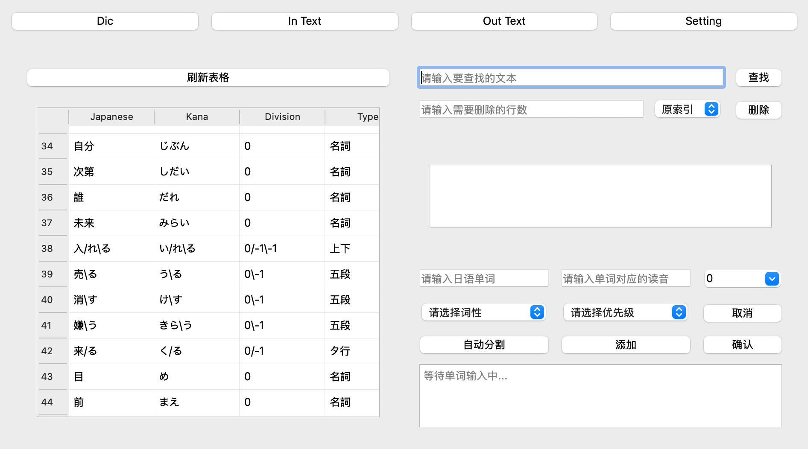
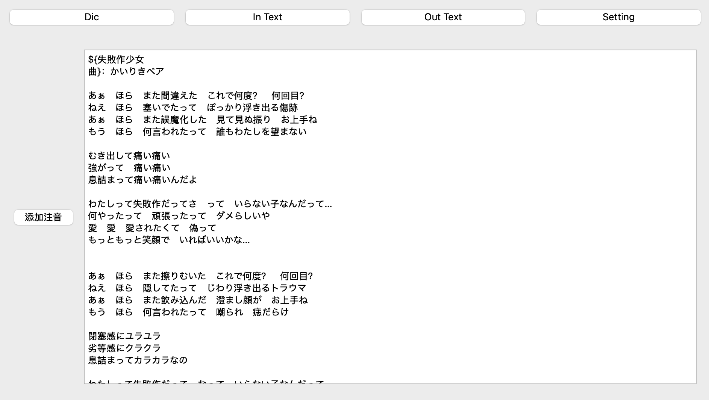
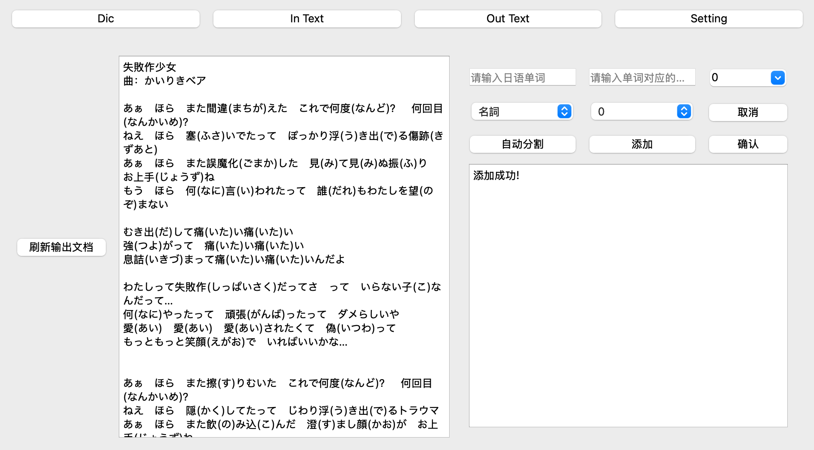
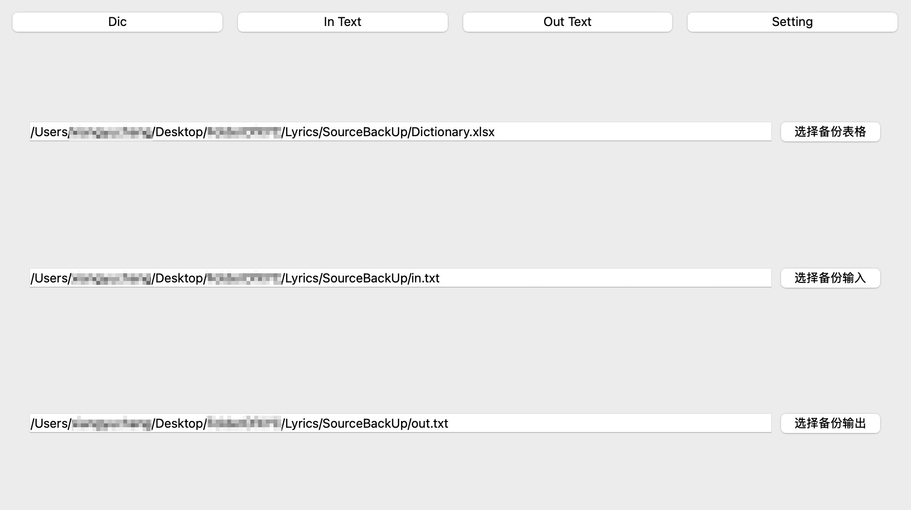

# FuriganaAdding

这是由OneThree开发的一个用于给日语文本注音（给其中的汉字附上振假名）的应用。

## 功能

在应用界面的最上方有四个按钮：Dic, In Text, Out Text和Setting，点击按钮即可进入对应页面

### Dic页面

页面左侧是应用内部存储的表格（作为字典），列索引为日语单词、假名标注、分割方式、词性、优先级。在对表格进行修改之后`点击上方的刷新表格按钮`即可更新修改后的表格  

页面右上部分第一行为查询区域，在文本框中输入文字，`按下回车键`或`点击查找按钮`，即可查询在`日语单词`部分或`假名标注`部分含有该段文字的所有词语信息  
查询得到的结果将会以表格的形式出现在下方，除了原本的列索引之外，在日语单词列之前添加了两列`原索引`和`子索引`，分别表示在原表格中该词语的索引和在查询得到的子表格中该词语的索引  
页面右上部分第二行，在输入框中输入索引的值，在右侧下拉框中选择原索引或是子索引，然后点击删除键，即可在表格中删除对应的单词  

页面右下方为新词语添加区域，前两个输入框为日语单词和假名标注的输入框，接着是分割方式的输入框，也可以进行下拉选择，再接着两个是词性和优先级的下拉选择框。接着是取消、自动分割、添加和确认按钮  
在输入框中输入日语单词和假名标注，下拉框选择好词性和优先级之后，可以选择点击自动分割按钮，在输入合法的情况下，应用会自动生成日语单词、假名标注的分割和分割方式（用户也可以自行分割），若输入非法，会在下方显示错误信息。分割完成之后点击添加按钮，系统在判断合法性之后（若非法也会在下方显示错误信息）点击确认按钮即可成功将词语添加至内部表格，若点击取消按钮则取消本次添加操作

### In Text页面

右边是一个可编辑的输入框，用以输入将要注音的文本  
左边是添加注音按钮，点击该按钮将输入框中的文本保存至内部输入文档，并将添加注音后的文本保存至内部输出文档

### Out Text页面

最右侧为和`Dic页面`中相同的新词语添加区域  
左侧为不可编辑的输入框和刷新输出文档按钮，点击按钮即读取内部输入文档，添加注音后保存至内部输出文档并显示在输入框中

### Setting页面

有三行选择备份文件的控件，点击对应按钮即可选择备份文件，这样当保存表格、输入文档、输出文档至应用内部时，其内容也会同步存储至备份文件内。表格和文档的文件类型为`.xlsx`和`.txt`

## 开发环境

-编程语言：Python
-GUI框架：PyQt5

## 快速开始

### Windows用户（待反馈）
请在终端中打开项目文件夹（FuriganaAdding）
在终端中运行命令`make generate`以生成图标
在终端中运行命令`make venv`以生成虚拟环境
在终端中运行命令`make`以生成应用程序
如果过程顺利，你可以在生成的`dist`文件夹中找到名为`Furigana.exe`的程序
双击该应用程序，或者回到项目文件夹并运行`make run`即可打开应用程序

### MacOS用户
请在终端中打开项目文件夹（FuriganaAdding）
在终端中运行命令`make generate`以生成图标
在终端中运行命令`make venv`以生成虚拟环境
在终端中运行命令`make`以生成应用程序
如果过程顺利，你可以在生成的`dist`文件夹中找到名为`Furigana.app`的程序
双击该应用程序，或者回到项目文件夹并运行`make run`即可打开应用程序

### Linux用户（待反馈）
请在终端中打开项目文件夹（FuriganaAdding）
在终端中运行命令`make venv`以生成虚拟环境
在终端中运行命令`make`以生成应用程序
如果过程顺利，你可以在生成的`dist`文件夹中找到名为`Furigana`的程序
双击该应用程序，或者回到项目文件夹并运行`make run`即可打开应用程序

## 关于合法输入与合法分割

为了提高注音的准确性，在本应用中采取了保存词语词性和分割词语的方式

### 日语的词性

关于日语词性的分类有很多说法，在本应用中将其分为两大类：`词尾会变形的词语`和`词尾不变形的词语`  
在本应用中，词尾不变形的词语包括名词、代词、感叹词、形容动词等，
词尾会变形的词语包括动词、形容词  

本应用将词尾不变形的词语一律视为`名詞`词性  
对词尾会变形的词语而言，进一步细分为`五段`，`上下`，`サ行`，`カ行`，`形容`五类  
详细说明如下：
* `五段`即五段活用動詞，或第一类动词，指以`う、く、す、つ、ぬ、む、る、ぐ、ぶ`中的某个假名作为词尾且变化为`连用形+ます`的形式时词尾变化为相应行的い段假名的动词，如`買う`，`遊ぶ`等（注：由于词语`行く`的`连用形+て`的形式`行って`属于特例，所以请将其作为名词处理，且其已经被包含在提供的数据库之中）  
* `上下`即上一段活用動詞和下一段活用動詞的合称，或第二类动词，指以`い段假名或え段假名+る`为词尾且变化为`连用形+ます`的形式时词尾变化为去除`る`的动词，如`消える`，`伸びる`等
* `カ行`即カ行変格活用動詞，指词语`来る`
* `サ行`即サ行変格活用動詞，指词语`する`以及以`する`为词尾的动词，如`接する`，`察する`等
* `形容`即形容詞，指以`い`为词尾且变化为`连用形+て`的形式时词尾变化为`く`的词语，如`高い`，`素晴らしい`等

### 合法输入

请按如下要求填写各个输入框：
* 日语单词：完整的单词，形容动词仅保留词干
* 假名标注：单词对应的读音，日语单词内包含的假名请按照单词内的形式写出，如`化け物`->`ばけもの`，`カリスマ性`->`カリスマせい`等
* 分割方式：合法的分割方式
* 词性：和单词匹配的词性
* 优先级：0为默认优先级，1优先级意为在0优先级之前匹配，2优先级意为之在2优先级的词语之中进行匹配（如：在优先级一样的情况下会出现`止め処`的`止め`部分与`止める`匹配而`処`未被注音的现象，因此需要将`止め処`的优先级设为1；词语`未だ`有`いまだ`和`まだ`两种常见读音，需要将相对少见的`まだ`的优先级设为2）

### 合法分割

* 日语单词：将汉字部分和假名部分用`/`分割，如果有词尾，将词尾和其余部分用`\`分割（认为`る`为`上下`类型词语的词尾）
* 假名标注：将和日语单词对应的部分用`/`和`\`分割
* 分割方式：日语单词中汉字部分为`0`，假名部分为`-1`，用`/`和`\`将数字分割

在日语单词、假名标注、优先级对应的时候，点击`自动分割`按钮，应用会自动分割日语单词、假名标注并生成对应的分割方式

## 关于输入文件

* 使用`$`字符使程序跳过下一个字符，如`$映る`的`映`不会被注音
* 使用`${}$`使程序跳过`{}`中的内容
* 使用`@`使此处采用`2`优先级字典

## 待完成事项  
表格对`.csv`类型文件的适配  
支持`.txt`导入输入文档功能  
支持生成`.txt`文档等功能  
...

## 贡献指南

## 常见问题（FAQ）